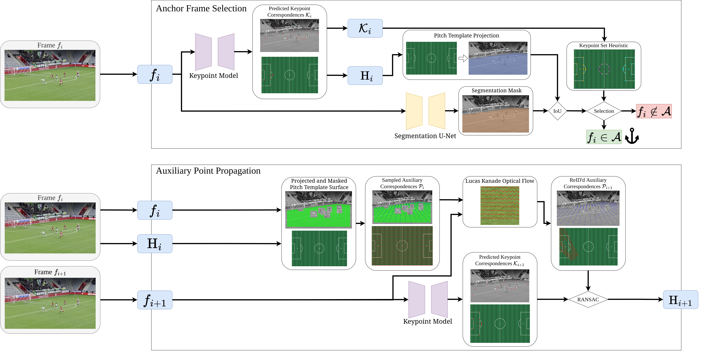

# AuxFlow: Anchor-Grounded Homography Estimation through Flow-Guided Auxiliary Points for Soccer Field Registration and Player Localization


>**[AuxFlow: Anchor-Grounded Homography Estimation through Flow-Guided Auxiliary Points for Soccer Field Registration and Player Localization, CVIU]((https://doi.org/10.1016/j.cviu.2026.104662))**
>Julian Ziegler, Daniel Matthes, Patrick Frenzel, Mirco Fuchs


## Abstract

We introduce AuxFlow, a novel, temporally-aware pipeline for homography estimation and field registration in challenging football broadcast footage. To overcome the temporal instability and high performance variance of existing per-frame keypoint methods, our AuxFlow approach combines a robust frame-wise keypoint model with a temporal propagation strategy. The system automatically identifies high-confidence "anchor" frames where it estimates the homography solely based on the keypoint model, before sampling auxiliary points, which are re-identified in neighbouring frames using optical flow to establish dense, coherent correspondences across the sequence. This significantly enhances the stability and accuracy of the estimated homographies. Our evaluation on the SoccerNet GSR dataset shows consistent, measurable improvements in robustness and smoothness over existing State-of-the-Art, enabling highly reliable player localization invaluable for downstream applications.

## Run

This implementation is consistent with the standard GSR repository. All configurations can be adjusted in the [soccernet.yaml](sn_gamestate/configs/soccernet.yaml) config file.
Please open an issue or contact Julian Ziegler directly under julian.ziegler@htwk-leipzig.de if you are having issues.

## Citation
Please cite our work if you use AuxFlow:
```bibtex
@article{ZIEGLER2026104662,
title = {AuxFlow: Anchor-grounded homography estimation through flow-guided auxiliary points for Soccer field registration and player localization},
journal = {Computer Vision and Image Understanding},
pages = {104662},
year = {2026},
issn = {1077-3142},
doi = {https://doi.org/10.1016/j.cviu.2026.104662},
url = {https://www.sciencedirect.com/science/article/pii/S1077314226000299},
author = {Julian Ziegler and Daniel Matthes and Patrick Frenzel and Mirco Fuchs},
}
```

## Updates

The repository is still work in progress and adjustments to documentation and readability will be made.

